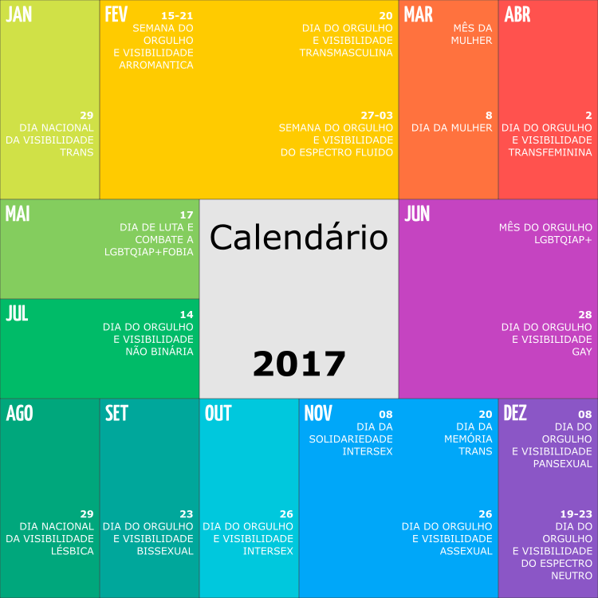

# LGBTQIAP+ Calendar
LGBTQIAP+ calendar with important days

This open and editable version of the calendar shared by [RExistência Não Binária: Calendário 2017](https://www.facebook.com/RexistenciaNaoBinaria/photos/a.487253414998873.1073741890.375864172804465/487258664998348/).

It was created using [Inkscape](https://inkscape.org/) and the [Yanone Kaffeesatz](https://fonts.google.com/specimen/Yanone+Kaffeesatz) font.

## Files

- lgbtqiap-calendar.md: Calendar reference file, with information for each day (when available)
- lgbtqiap-calendar.svg: Calendar itself
- lgbtqiap-calendar.png: Raster image of the calendar

## Information

The current version is a 1:1 version of the original source, some date are local to Brazil and some date don't have a reference to support them. The ideia in the future is to create country specific versions and or to create a global one inspired by the [List of LGBT awareness days](https://en.wikipedia.org/wiki/List_of_LGBT_awareness_days) article.
